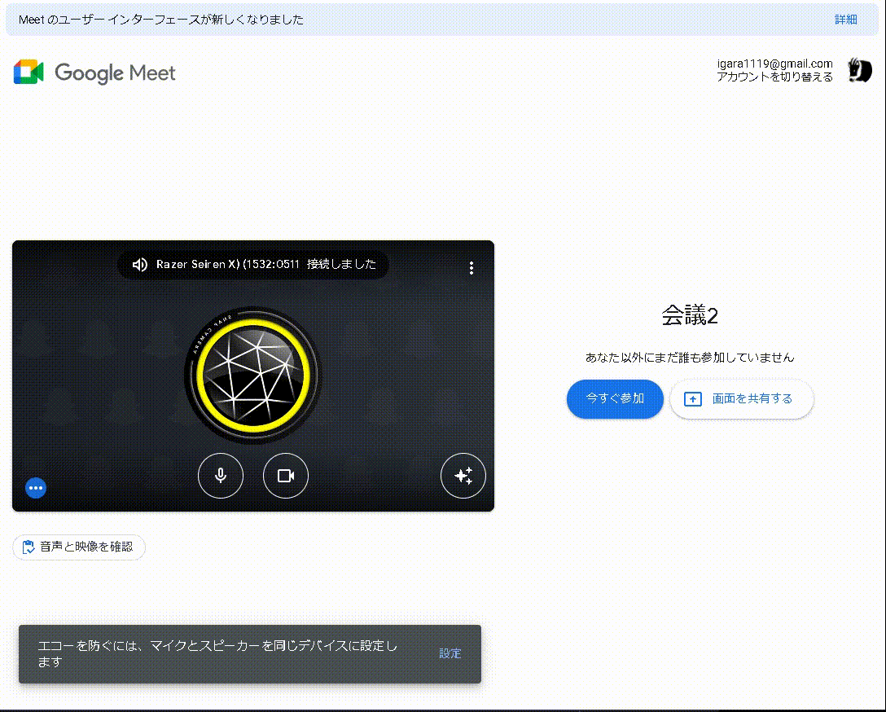
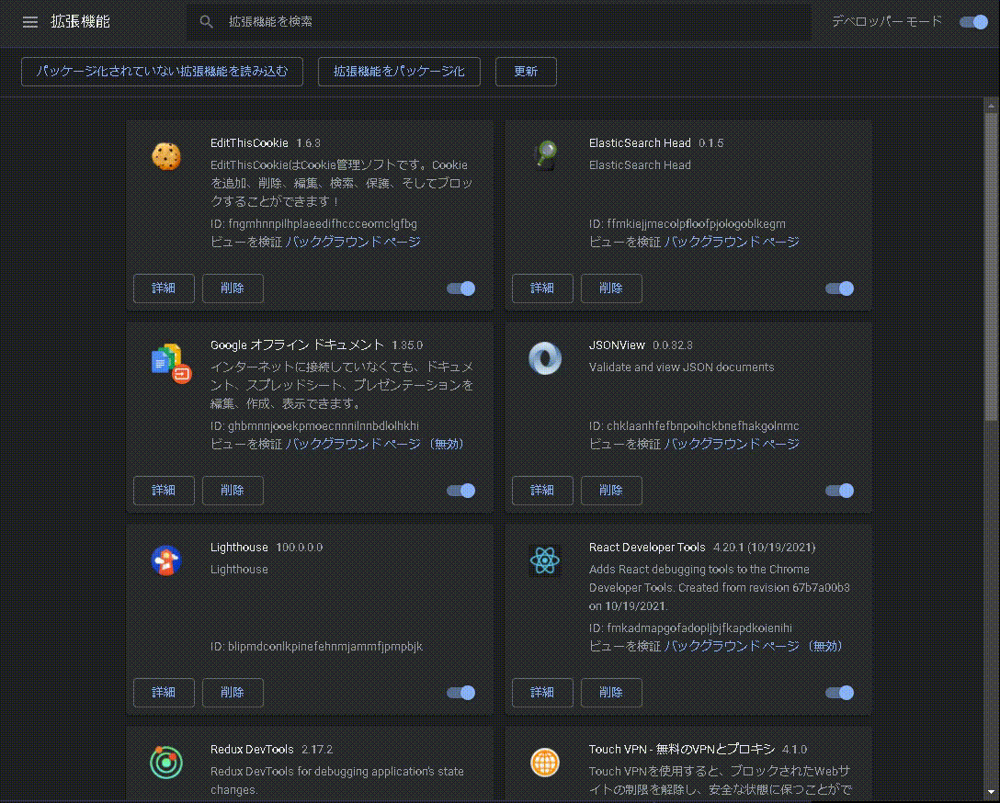

# meet_chrome_extention

## I can do

### Meet Comment Memo



## Develop

### Setting

```
npm install
npm lint
npm test
npx rimraf dist
npm build
```

#### Install Chrome Extention

select dist folder


